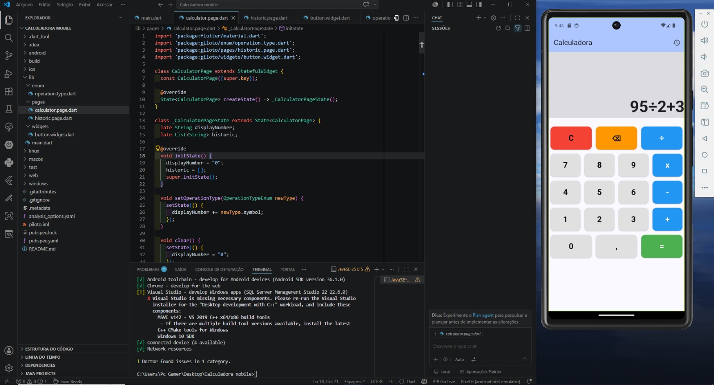
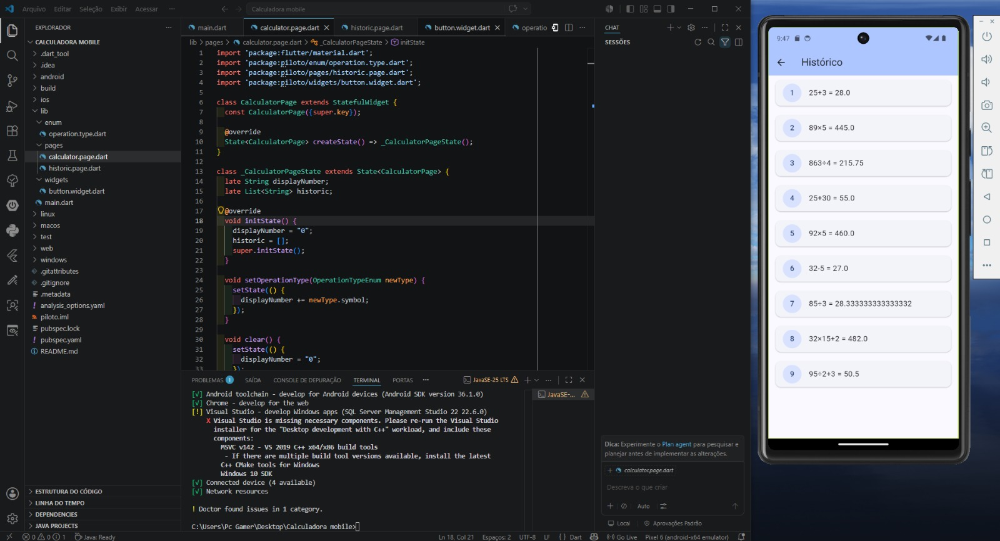

# Calculadora mobile
Aplicativo de calculadora multiplataforma desenvolvido com Flutter e Dart.
# 🧮 Calculadora Mobile

Uma calculadora mobile completa desenvolvida com **Flutter** e **Dart**, com suporte a múltiplas plataformas e respeito às regras matemáticas de precedência de operações.

---

## 📱 Plataformas Suportadas

| Plataforma | Suporte |
|------------|---------|
| Android    | ✅      |
| iOS        | ✅      |

---

## ✨ Funcionalidades

- ➕ **Adição**
- ➖ **Subtração**
- ✖️ **Multiplicação**
- ➗ **Divisão**
- 📐 **Precedência de operações** — multiplicação e divisão são calculadas antes de adição e subtração
- 📜 **Histórico de resultados** — acompanhe todas as operações realizadas

---

## 🚀 Tecnologias

- [Flutter](https://flutter.dev/) — Framework multiplataforma para desenvolvimento mobile
- [Dart](https://dart.dev/) — Linguagem de programação utilizada pelo Flutter

---

## 🛠️ Como Rodar o Projeto

### Pré-requisitos

- [Flutter SDK](https://docs.flutter.dev/get-started/install) instalado
- [Android Studio](https://developer.android.com/studio) ou [Xcode](https://developer.apple.com/xcode/) configurado
- Emulador ou dispositivo físico conectado

### Passos

```bash
# Clone o repositório
git clone https://github.com/seu-usuario/flutter-calculator.git

# Entre na pasta do projeto
cd flutter-calculator

# Instale as dependências
flutter pub get

# Rode o projeto
flutter run
```

---

## 📂 Estrutura do Projeto

```
calculadora-mobile/
├── lib/
│   └── main.dart       # Código principal do app
├── android/            # Configurações Android
├── ios/                # Configurações iOS
├── pubspec.yaml        # Dependências do projeto
└── README.md
```

---

## 📸 Screenshots



---

## 📄 Licença

Este projeto está sob a licença MIT. Veja o arquivo [LICENSE](LICENSE) para mais detalhes.
